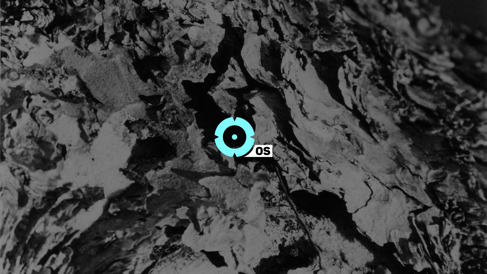

# HELVE OS | Personal Organization Micro webOS

**HELVE OS** is a website/server-based personal organization microOS (POMOS Master Shell). Habit Automation System with multiple programs working in unison. 

Its purpose is to track, maintain and analyse behavioral productivity of the user while establishing creative project databases available for public and private access alike.

It contains *shells* that act as system functionalities.

Shells
----------
Layers of "ozone software". Develop the term ozone software.

# BRIEF/SHELL - Helve OS Voice Bot Assistant System

**Brief** *brfshell*

Shell Placement: helve.live/#brief

**Brief's** fundamental part is the *Habit Automation System*. It enhances speed of communication, task management and assignment, note-taking, scheduling, overview analysis of current project progress and status etc. **Brief** HAB is based on the principles of [Project Dopamine Trails](https://github.com/HELVE/DOPAMINETRAILS), which helps clarify your core drives, maximizes focus and minimizes friction in getting things done through rewiring the notion of dopamine triggers and using them productively.

Moment-establishing voice bot assistant with visuals containing Habit Automation System. Voice assistant for all organization and data purposes. Streamlines the day schedule with no need to check the screens. Contains a variety of subprograms designed to carry the data load for you so you can focus on what matters.

## Habit Automation System

### System Structure

System structure is based on [Project Dopamine Trails](https://github.com/HELVE/DOPAMINETRAILS). 

Helve Directive Protocols (Dopamine Optimization Framework) contain Operations (overarching effort loops), Operations contain Programs (specific types of routines that establish habits in certain life aspects over time), Programs contain Modules (narrative structures that help address specific sections of certain Programs).

Core Drives_ (Top Abstract) > 

Protocols_ (Top Abstract) > 

Operations_ (Top Abstract) > 

Master Programs_ > 

Programs_ (Base Abstract) > 

Modules_ (Base Abstract)

- PSY_OPS - psychological operations.
- CON_OPS - control operations.
- PHY_OPS - physical operations (?)  <- merge this one with psychological since it's just as much external.

### THE RITUAL OF THE RISING SUN

**DEFAULT SILENT STATE**

Fullscreen looping video of the node network visual with Helve AVR logo on boot up, electronic noise beep as it starts, then a 10 second break. Binaural sounds. First 30 seconds are soothing, relaxing binaurals that go along with the voice greeting you.

**PSYOPS: Computer, activate HQ program / activate HQ / activate [COMPLETE]**

> Good morning, Helve Operative Mothnode. HQ has been activated. Initiating startup sequence. Relax, take a deep breath... and slowly exhale. Remember, thoughts and emotions are not your actual self. Remember, you're here to visually hack the world.

5 sec wait

> Selfinitiating "The Ritual of the Rising Sun" program.

> Welcome to "The Ritual of the Rising Sun" Habit Automation System. How are you feeling today?"

5 sec wait

> Harness your energy. Initiating data scanning and analysis. 
Operative Mothnode, here is today's progress timeline data. Please standby.

> Report Weather.

> Read today's Calendar.

10 sec wait

**PSYOPS: Computer, initiate physical training program [35MIN] [COMPLETE]**

> Ready for Phase 1 Physical Training Program?

5 sec wait

> Phase 1 Physical Training Program active. Initiating serotonine intake. Prepare the tools.

20 seconds break /// If possible - Bella Ciao starts playing.

> Let us commence. Activating Diaphragm Breathing Module. 2 minute timer. Straighten your posture, relax and take the stance.

> Begin.

2 min wait

> Module complete. Well done. Activating Wrist Stretching Module. 2 minute timer. Straighten your posture, relax and take the stance.

> Begin.

2 min wait

> Module complete. Good job. Activating Shoulder Circling Module. 2 minute timer. Straighten your posture, relax and take the stance.

> Begin.

2 min wait

> Module complete. Nailed it. Activating T Balance Right Module. 3 minute timer. Straighten your posture, relax and take the stance.

> Begin.

3 min wait

> Module complete. Let's switch. Activating T Balance Left Module. 3 minute timer. Straighten your posture, relax and take the stance.

> Begin.

3 min wait

> Module complete. Nicely done. Activating V-Bending Module. 4 minute timer. Straighten your posture, relax and take the stance.

> Begin.

4 min wait

> Module complete. Time to walk the plank. Activating Planking Module. 4 minute timer. Straighten your posture, relax and take the stance.

> Begin.

4 min wait

> Module complete. Let's move to the sides. Activating Side-planking Module Right. 4 minute timer. Straighten your posture, relax and take the stance.

> Begin.

4 min wait

> Module complete. Off to the other. Activating Side-planking Module Left. 4 minute timer. Straighten your posture, relax and take the stance.

> Begin.

4 min wait

> Module complete. Activating Pushups Module. 2 minute timer. Straighten your posture, relax and take the stance.

> Begin.

2 min wait

> Physical Training Program complete. Great effort Operative.

UNDER CONSTRUCTION_

**PSYOPS: Computer, initiate grounding program / grounding [INCOMPLETE]**

> Ready for Phase 2 Grounding Program?

> 5 second wait

> Phase 2 Grounding Program active. Let's ground you for a good start of the day, shall we?.

What's your latest accomplishment?

> 10sec break

> Well done Operative Mothnode, keep going. Remember, it's about the process not the goal. 

> Initiating Phase 2 Grounding Program. Please standby.

> 5 sec break

- **TECHMEDITATION MODULE**

> Initiating Techmeditation Module. Loading animalistic and core drive atunement variables. Standby to achieve balance.”

> 3 minutes countdown - prepare
> “Clear your mind”
> 1 sec break
> "Blue sky"
> 1h meditation with soothing music

- **CIRCLE OF INTENT MODULE**

> “Initiating Circle of Intent Module.”

> 5 sec break

> "Please draw 1/4th of a mental circle around you."
> "This is your space of self-intent. Thoughts processes directed inwards will stabilize your existing inner energy and ground your approach to yourself. Think about how you intend to treat yourself."

> 3min break

> "Please draw 2/4th of a mental circle around you."
> "This is your space of outward intent. Thought processes directed outward will stabilize your perception of others and create the way forward. Think about how you intend to treat others."

> 3min break

> "Please draw a 3/4th full mental circle around you."
> "This is your space of higher intent. Thought processes directed into the void will summon positive energy within you. Think about how you intend to use that energy."

> 3min break

> "Please draw a full mental circle around you."
> "This is your space of general intent. Thought processes now need to be grounded on the observed reality and will gain initial direction and create a spark of willpower due to clarity. Think about your day's overall intent and focus."

**PSYOPS: Computer, initiate medbay [INCOMPLETE]**

> Computer, Initiate Medbay Program.

> “Initiating Medbay Program.”

> "Medbay Attention Required. Take your resistants."

mobile alarms with custom recordings with the same voice

> "Initiate Nutrition Program"

> Computer, query sequence.

> Sequencing: shave, shower, breakfast, tea, CBD. (...) Starting soothing music to accomodate the mind to rebirth.

After the voice starts the music, it turns to more uplifting, energetic, focus-driven beat.
The music plays for about an hour.

> "Take your self-care
> “Hydrate”
> “Take a break”
> “GitHub commit required”
> “Walk around”

> What should I set the focus to today?

**Brief Ending**

PC lights up and animated Helve AVR logo appears on screen.

> "Helve HQ is now live and operational. Commence with directive protocol programs. Have a great day!"

> Initiating LiveOps. Up next, Helve Briefing, Directive Protocol Beta, Knowledge.

**Flash News Briefing.**

TechCrunch, Reuters, Science News - examples.

### Emergency Commands

**PSYOPS: Voice Bot Check-in Message - Computer, checking in / access mainframe [INCOMPLETE]**

> Identity confirmed: Helve Operative mothnode, access granted. Authorization key: x Welcome to mobile Helve HQ!

**CONOPS: Computer, lock it up / initiate lockdown [COMPLETE]**

Control operations. Automated at 8PM. Later on it will involve using smart devices to adjust everything around the HQ.

> Protocol Omega Active, Lockdown procedures initiated. Standby.

Perhaps add: Remember to commit on GitHub?

> Wait 5 seconds.

> Procedural status, complete. Sensors fully functional and running. Good night, Helve Operative mothnode. Approach the REM landscapes in peace. 

**PSYOPS: Computer, talk me down [COMPLETE]**

> Operative, I need you to know that you're going to be okay.

> Relax, take a deep breath and slowly exhale... Remember, thoughts and emotions are not your actual self. They are scripts running your body based on external factors. No need to attach significance to them.

> Now, take a step back into your core self and see the bigger picture.

### Misc Commands

> Computer, rap playlist.

Spotify Thug Mood playlist. Requires more custom name?

> Computer, metal playlist.

Spotify Aggro Mood playlist. Requires more custom name?

> Computer, smooth playlist. 

Spotify Smooth Moood playlist. Requires more custom name?

### Routine Ideas

- Computer activate Helve AVR workspace (teal clr) [SITUATION CONTEXT]
- Computer activate Hitech Crime workspace (red clr) [SITUATION CONTEXT]
- Computer activate Kannibal workspace (white clr) [SITUATION CONTEXT]
- Computer define our core values
- Computer define our core drive (to visually hack the world)
- Computer activate introduction (guest protocol)
- Computer list service offers
- Computer list active ops
- Computer what's the current number of projects in database
- Computer define our directive protocols
- Computer, current Operative list
- Computer give me the brand uptime
- Computer initiate/activate lockdown
- Reminder: Hydration Required (every 3 hours)
- Reminder: Activate Lockdown Procedures (at the end of the day)
- Reminder: Nutrition? 2 times a day
- ACTIVE Reminder: Set up GitHub commit 2 times a day
- Computer, quick mantra: Please repeat after me. I am  patience. I am compassion. I am wisdom. I am love. I am selfless. Everything that I'm experiencing right now will pass eventually. I am powerful and I deserve every power-filled thing in the universe. Remember that not all the things are directly about you. Often people reflect themselves upon you.

---
Notes:  "It is 26th April 2019, weather is cloudy, 20 degrees outside."

/// Find a way to incorporate the weather and date)

HELVE HQ_ RITUAL OF RISING SUN

“Good morning Helve Operative mothnode. It is 26th April 2019, weather is cloudy, 20 degrees outside.” 
“How are you feeling today?”
“Shall we begin the techmeditation module?”

“Initiating intent programming module”
“What should I set the focus to today?”
“Hydrate”

“Take a break”
“GitHub commit required”
“Walk around”

---

# EDGE/SHELL
helve.live/#edge
**Edge** *edgshell*	
Project database. States: Open (Void), Active (Ascension), Release (Fulfilment).

---

# GRIP/SHELL
helve.live/#grip
**Grip** *grpshell*	
Graphical interface of HELVE. It binds the sub-shells together.

---

# LINE/SHELL
helve.live/#line
**Line** *linshell*
Displays & analyses various data relating to passage of time through a multi-linear data timeline.

---

# POINT/SHELL
helve.live/#point
**Point** *pntshell*
Data tracker and parser. Tracks and analyses edgshell task, time management and categorization input, *linshell* time stamps and event points.

---

# NUTRI/SHELL
helve.live/#nutri
**Nutri** *ntrshell*	
Nutrition and supplies tracker.

---

# FUND/SHELL
helve.live/#fund
**Fund** *fndshell*
Crowdfunding.

---

**LIVE WEB ACCESS**

helve.live/#oasis
**Oasis** *osishell*
Live workspace widget. MIXER CONNECTION

helve.live/#hq

Etymology
----------

Etymologic meaning of the word *helve* constitutes a handle of a weapon or tool. All system shells are named and structured after specific parts of such an object.
